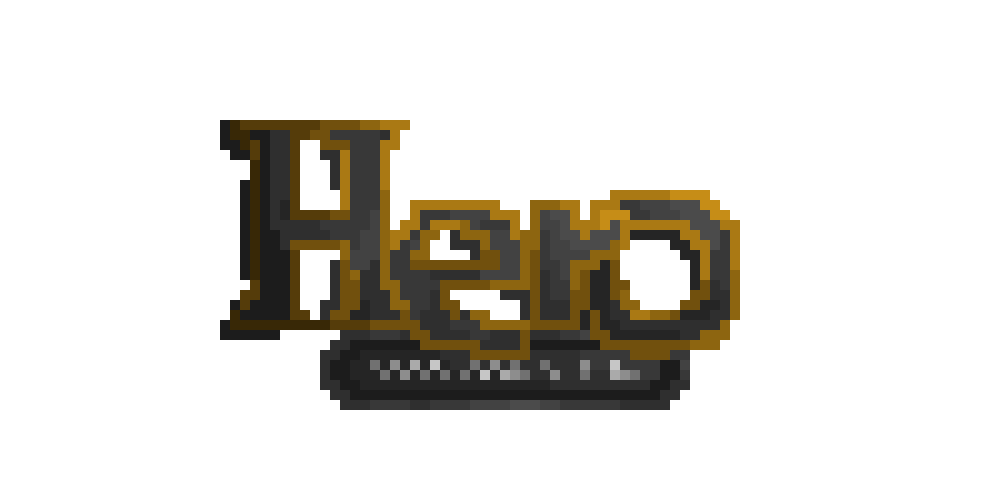

# HTWG AIN3 SE 
Scala - Hero Project
=====================================================
## The journey of our first Scala based video game
`INFO:` If you want to clone the repository and play the game with GUI, set the environment variable UI_TYPE=full  

Code written: [Alina Göttig](https://github.com/AlinaGoettig) & [Ronny Klotz](https://github.com/ShuraBlack)

Graphic design: Ronny Klotz

Hero is based on the classic strategy video game series "Heroes of Might and Magic". 
Our goal is to make a stand alone out of the combat system, in which both main factions, Castle and Inferno fight each other.
This fight represents the epic battle between angels and demons.

The player will controll one of the choisen sides on a tile-like battleground. Each player get 7 unique creatures with
different values, like health points, damage amount, movment speed, etc. to fight until somebody got nothing left.

## HowToPlay

[HowToPlay - YoutTube](https://youtu.be/xgbU-B7nY3g)

  Start up a new game or load an already existing save game in the main menu

  Each player choose a side at the beginning of a new game

  Click on a black frame to move to the position

  Ranged creatures can attack from everywhere

  while melee creature need to have a black frame near them to be attackable

  Kill all creatures of a side to win

## Graphics

## Project information

This project was developed in the course of the third semester at the HTWG-Konstanz (Applied Computer Science) in the lecture
Software Engineering.

Type | Version
:--- | ---:
Java JDK  | 1.8 
Scala | 2.12.7
Sbt | 0.13.18

Dependencies |
:--- |
Junit  |
Scala Swing |
Scalastic |
Scala Guice |
Scala Xml |
Play Json |
Util Audio |

The following tasks were completed in the course of the lecture

           
Tasks

           
Project Setup with SBT

           
Version Control Systems - Git

           
Agile Development

           
Text User Interface

           
MVC Architecture

           
Continuous Deployment

           
Design Pattern

           
Undo/Redo Manager

           
Graphical User Interface

           
Components

           
Dependency Injection

           
FileIO

           
Docker

## Links about the main game

[Wikipedia](https://de.wikipedia.org/wiki/Heroes_of_Might_%26_Magic_3)

[Publisher](https://www.ubisoft.com/de-de/game/heroes-of-might-and-magic-3-hd)

[Buy the Game (Gog.com)](https://www.gog.com/game/heroes_of_might_and_magic_3_complete_edition)

## Coverage in Master Github branch:

## Coverage in TextUI Github branch:

